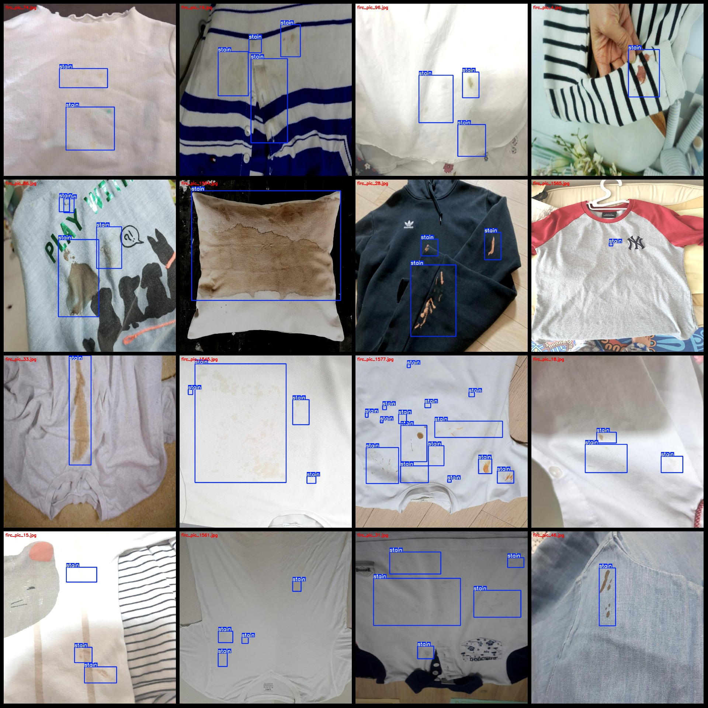
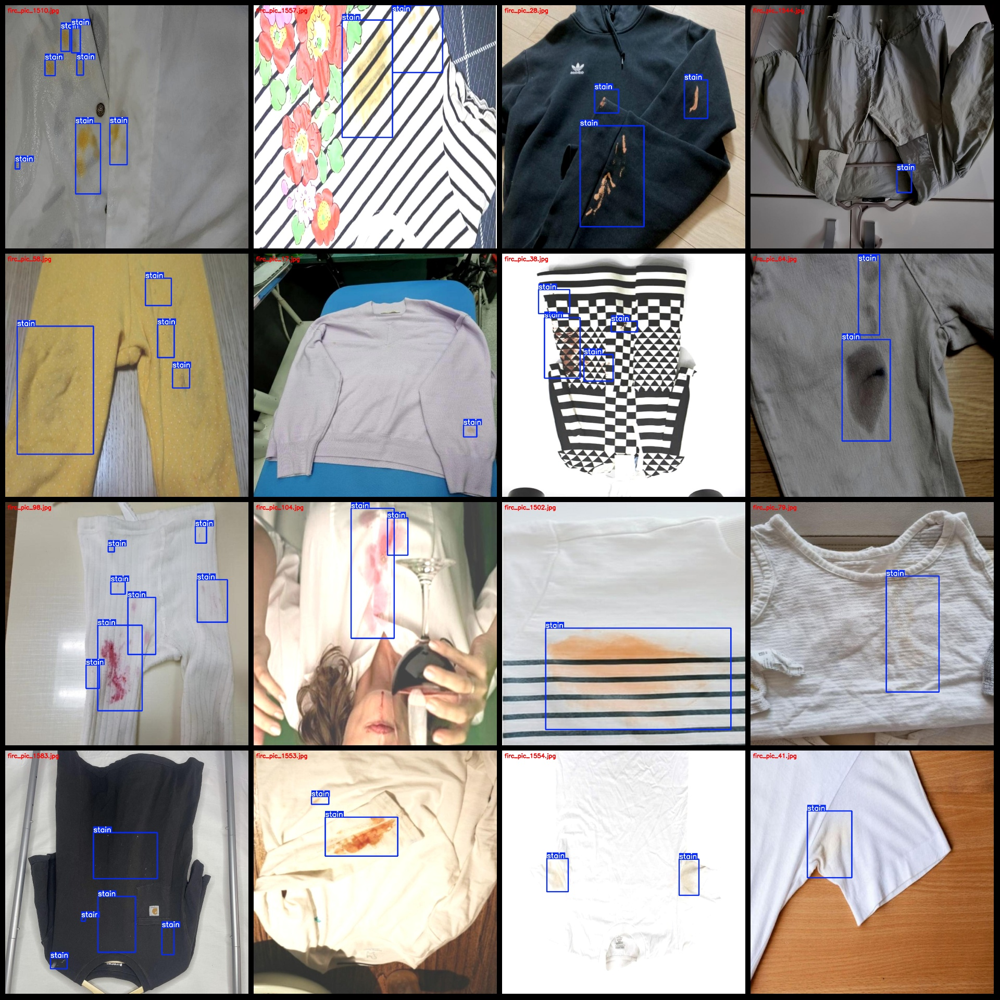

# Clothing Stains Detection Dataset VOC+YOLO Format with 221 Images in 1 Category

The dataset format: Pascal VOC format + YOLO format (txt file without split path, just containing jpg images and corresponding VOC format xml files and yolo format txt files).
Number of images (jpg file counts): 221
Number of annotations (xml file counts): 221
Number of annotations (txt file counts): 221
Number of annotation categories: 1
Annotation category name: "stain"
Number of bounding box per category: 834
Total number of bounding boxes: 834
Number of images each category occupies:
stain occupies images = 221
Image resolution: 1024x1024
Annotation tool used: labelImg
Annotation rule: draw a rectangle around the category
Important notice: The dataset does not have been divided into training, validation, or test sets; you need to divide it yourself.
Special statement: This dataset does not guarantee the accuracy of the trained model or the weight files.
Image preview:
Annotation example:

## Images

Here is a pay link on Stripe ( https://buy.stripe.com/3cs8yP7sY87d0vu9AB ). Please contact me lonlonago@foxmail.com after funding $89, and I will send you a complete data files , thank you!

